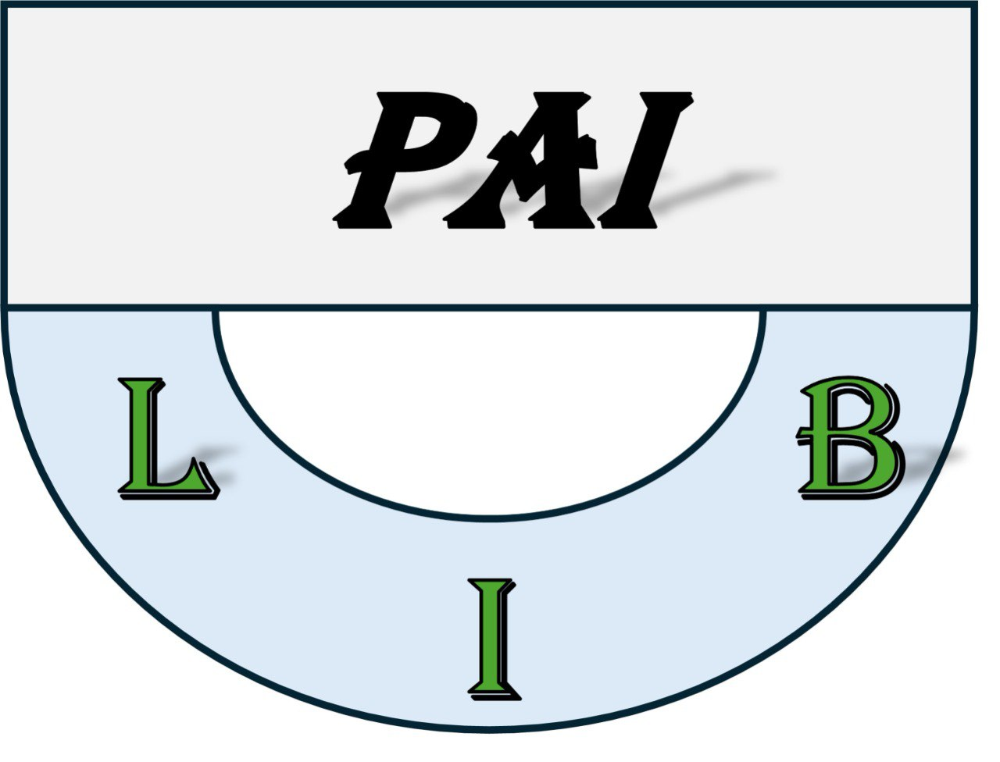

<div style="width: 100%; display: flex; justify-content: center;">
  
</div>
 
# Pseudo-Anomaly Insertion Library (PAI-Lib)

## Overview:  
> This project aims to enhance self-supervised anomaly detection by integrating synthetic anomaly generation techniques to improve both detection and segmentation performance in industrial environments. The framework introduces various anomaly insertion methods, categorized into source-free and source-based approaches, to address different manufacturing defect detection challenges.

## Anomaly Generation Approaches:  
### 1. *Source-Free Methods (SFI)*:  
   - Directly modify normal images by introducing transformations such as rotations, noise, or pixel manipulations to simulate defects without requiring external source images. SFI techniques are: *CutPaste, CutPaste Scar, Simplex Noise, Random Perterbuation, and Hard-Augment CutPaste*. 

### 2. *Source-Based Methods (SBI)*:  
   - Generate anomalies using external source images, ensuring realistic defect representations by integrating features from real-world defective samples. SBI techniques are: *Perlin-Noise Pattern, SuperPixel Anomaly, Perlin with ROI selection, Random Augment CutPaste*.

### Implementation via PAI Lib:  
- The PAI (Pseudo Anomalous Image) Library provides APIs for anomaly insertion and generates corresponding ground-truth masks for training models.  
- The following process follow to generate anomalies:
  - A normal image (i_n) is processed using either a source-free or source-based technique.
  - If a source-based method is selected, an additional anomaly source image (i_s) is required.
  - The output consists of a pseudo-anomalous image (i_a) and its corresponding segmentation mask (m_a).

### Expected Impact:  
This framework provides a robust solution for anomaly detection and segmentation in manufacturing, improving efficiency and reliability by enabling self-supervised learning with high-quality synthetic anomaly data.

---
# Installation
> Use either Docker or Conda Environment
## Create Docker Environment
```
    docker build -t pail_test .
    docker run -it -d pail_test
```
##### *Attach docker container to VS code to run the anomaly Generation*
---
## Create Conda Environment
```
    conda create -n pai_lib --file requirement.txt
    conda activate pai_lib
```
---
# Usage
## Import library and read normal and anomaly source images
```python
    from pai import pai
    import numpy as np
    import os
    import cv2
    normal_img_path         =  'example_img/example_0.jpg' #,
    anom_sourc_path         =  'anom_source_imgs'
    try: anom_source_files  =  [os.path.join(anom_sourc_path,file) for file in  os.listdir(anom_sourc_path)]
    except Exception as e: print("Anom Source Data does not Exist")
    height,width            =  256,256
    ##############################################################################
    try:
        anom_source_index   =  np.random.choice(len(anom_source_files),1)[0]
        anom_source_img     =  cv2.imread(anom_source_files[anom_source_index])
        anom_source_img     =  cv2.resize(anom_source_img, (width, width))
    except:
        # create one dummy image for anomaly source
        print("Anomaly Source Image data does not Exist so initialize with ones image") 
        anom_source_img     =  np.zeros((height,width,3),dtype=np.uint8)
    try:
        normal_image        =  cv2.imread(normal_img_path) 
        normal_image        =  cv2.resize(normal_image, (width, width))
    except Exception as e:
        # create one dummy image for anomaly insertion 
        print("Normal Image data does not Exist so initialize with zeros image")
        normal_image        =  np.ones((width,width,3),dtype=np.uint8)*255
    ##############################################################################
    anom_insertion  =    pai.Anomaly_Insertion() 
``` 
##  **Source Free Methods (SFI)** 

### - Cut-Paste scar Example 
### CutPaste: Self-Supervised Learning for Anomaly Detection and Localization
### https://arxiv.org/pdf/2104.04015.pdf
```python
    aug_img,msk     =    anom_insertion.cutpaste_scar(normal_image) 
```
### - Simplex noise Anomaly Example 
### Revisiting Reverse Distillation for Anomaly Detection) 
### https://openaccess.thecvf.com/content/CVPR2023/papers/Tien_Revisiting_Reverse_Distillation_for_Anomaly_Detection_CVPR_2023_paper.pdf
```python    
    aug_img,msk     =    anom_insertion.simplex_noise_anomlay(normal_image)
```
### - Random Perturbation Example 
### Collaborative Discrepancy Optimization for Reliable Image Anomaly Localization) 
### https://ieeexplore.ieee.org/stamp/stamp.jsp?tp=&arnumber=10034849 ########################
```python    
    aug_img,msk     =    anom_insertion.random_perturbation(normal_image)
```    
### - Hard Augment CutPaste 
### ANOSEG: ANOMALY SEGMENTATION NETWORK USING SELF-SUPERVISED LEARNING)     
### https://openreview.net/pdf?id=35-QqyfmjfP 
```python   
   aug_img,msk     =    anom_insertion.hard_aug_cutpaste(normal_image)
```
### - Cut and Paste Example 
### CutPaste: Self-Supervised Learning for Anomaly Detection and Localization
### https://arxiv.org/pdf/2104.04015.pdf 
```python    
    aug_img,msk    =    anom_insertion.cutpaste(normal_image)
```

---

## **Source based Methods (SBI)** 

### - Perlin Noise Example
### DRÆM – A discriminatively trained reconstruction embedding for surface anomaly detection 
### https://arxiv.org/pdf/2108.07610.pdf
```ruby
    aug_img,msk    =    anom_insertion.perlin_noise_pattern(normal_image, anom_source_img=anom_source_img)
```
### - Superpixel Anomaly Example 
### Two-Stage Coarse-to-Fine Image Anomaly Segmentation and Detection Model 
### https://www.sciencedirect.com/science/article/abs/pii/S0262885623001919
```ruby
    aug_img,msk    =    anom_insertion.superpixel_anomaly(normal_image, anom_source_img=anom_source_img)
```
### - Perlin ROI Anomaly Example 
### MemSeg: A semi-supervised method for image surface defect detection using differences and commonalities 
### https://arxiv.org/pdf/2205.00908.pdf 
```ruby
    aug_img,msk    =    anom_insertion.perlin_with_roi_anomaly(normal_image,anom_source_img=anom_source_img)
```    
### - Random Augmented CutPaste Anomaly Example 
### Explicit Boundary Guided Semi-Push-Pull Contrastive Learning for Supervised Anomaly Detection
### https://arxiv.org/pdf/2207.01463.pdf 
```ruby
    aug_img,msk    =    anom_insertion.rand_augmented_cut_paste(normal_image,  anom_source_img=anom_source_img)
```
### - Fractal Anomaly Generation (FAG) Example
### FRACTALAD: A SIMPLE INDUSTRIAL ANOMALY DETECTION METHOD USING FRACTAL ANOMALY GENERATION AND BACKBONE KNOWLEDGE DISTILLATION 
### https://arxiv.org/pdf/2301.12739.pdf 
```ruby
    aug_img,msk    =    anom_insertion.fract_aug(normal_image, anom_source_img=anom_source_img)
```
---
## Hybrid: SFI And SBI 
### - Affined Anomalay 
- AA and AAC (affined anomaly with color)
```sql
    aug_anom,msk   =    anom_insertion.affined_anomlay(normal_image)
```
- AAS (affined anomaly with anomaly source)
```sql
    aug_anom,msk   =    anom_insertion.affined_anomlay(normal_image,anom_source_img=anom_source_img)
```
---

# PAI (Pseudo-Anomaly Insertion Examples) 

