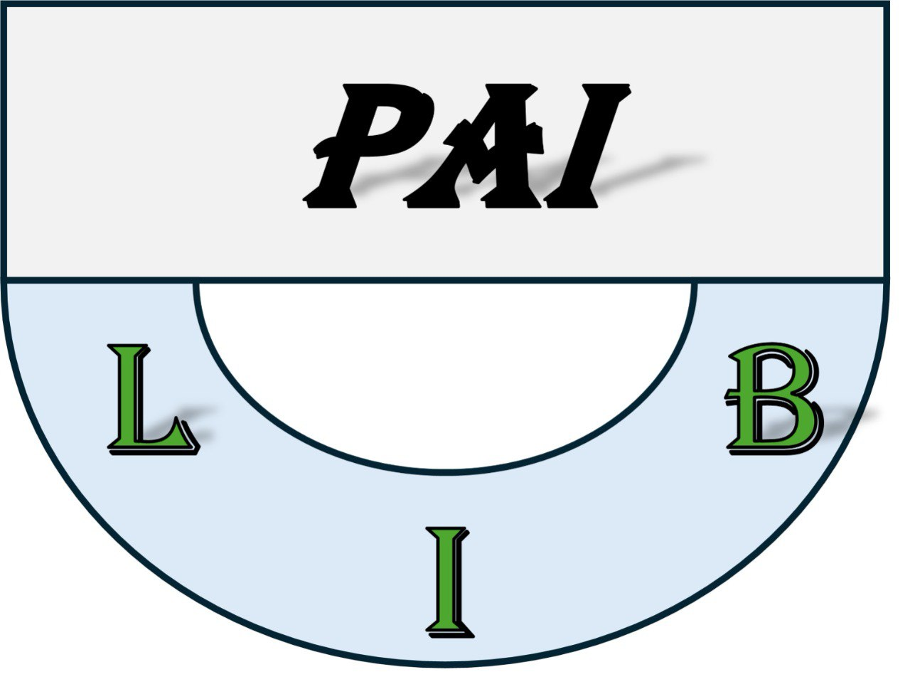

<div align="center">
  
</div>

<div align="center">

# Pseudo‑Anomaly Insertion Library (PAI‑Lib)

Synthetic anomaly generation for self‑supervised anomaly detection & segmentation.


</div>

---

## What is PAI‑Lib?

PAI‑Lib is a Python library that generates **pseudo‑anomalous images** and their **ground‑truth masks** to support **self‑supervised anomaly detection and segmentation** in industrial environments—especially when real defect data is limited.

**Input**
- Normal image: `i_n`
- Optional anomaly source image: `i_s` *(required for source‑based methods)*

**Output**
- Pseudo‑anomalous image: `i_a`
- Mask: `m_a` *(segmentation ground truth for the inserted region)*

---

## Table of contents
- [Features](#features)
- [Methods](#methods)
- [How it works](#how-it-works)
- [Installation](#installation)
  - [Option A — Docker](#option-a--docker)
  - [Option B — Conda](#option-b--conda)
- [Quickstart](#quickstart)
- [All anomaly insertion methods (examples)](#all-available-anomaly-insertion-methods-examples)
- [Examples](#examples)
- [Troubleshooting](#troubleshooting)
- [Changelog](#changelog)
- [Citation](#citation)
- [License](#license)
- [Contact](#contact)

---

## Features
- Unified API: every method returns `(aug_img, mask)`
- Source‑Free (SFI), Source‑Based (SBI), and Hybrid insertion methods
- Automatically generates segmentation masks
- Works well with OpenCV + NumPy pipelines
- Designed for industrial anomaly settings (e.g., MVTec‑style pipelines)

---

## Methods

### Source‑Free Insertion (SFI) — no anomaly source needed
- CutPaste
- CutPaste Scar
- Simplex Noise
- Random Perturbation
- Hard‑Augment CutPaste

### Source‑Based Insertion (SBI) — requires anomaly source image
- Perlin‑Noise Pattern
- Superpixel Anomaly
- Perlin with ROI selection
- Random Augment CutPaste
- Fractal Anomaly Generation (FAG)

### Hybrid (works with or without anomaly source)
- Affined Anomaly (AA / AAC / AAS)

---

## How it works

1. Load a **normal image** `i_n`
2. (Optional) Load an **anomaly source image** `i_s` for SBI methods
3. Apply an anomaly insertion method from PAI‑Lib
4. Receive:
   - `i_a`: pseudo‑anomalous image
   - `m_a`: mask of inserted anomaly area

---

## Installation

> Use either Docker or Conda Environment.

### Option A — Docker

```bash
docker build -t pail_test .
docker run -it -d pail_test
```

Attach the running container to VS Code (Docker/Dev Containers) to run anomaly generation interactively.

### Option B — Conda

```bash
conda create -n pai_lib --file requirement.txt
conda activate pai_lib
```

If you also have pip requirements:

```bash
pip install -r requirement_pip.txt
```

---

## Quickstart

### Minimal runnable example (copy/paste)

```python
from pai import pai
import numpy as np
import cv2
import os

H, W = 256, 256
os.makedirs("pai_outputs", exist_ok=True)

# Dummy images (replace with cv2.imread(...) in real usage)
normal_image = np.ones((H, W, 3), dtype=np.uint8) * 255
anom_source_img = np.zeros((H, W, 3), dtype=np.uint8)

anom_insertion = pai.Anomaly_Insertion()

# Source‑free
aug_img, mask = anom_insertion.cutpaste(normal_image)

cv2.imwrite("pai_outputs/cutpaste_img.png", aug_img)
cv2.imwrite("pai_outputs/cutpaste_mask.png", (mask * 255).astype("uint8"))
print("Saved outputs to pai_outputs/")
```

---

## All available anomaly insertion methods (examples)

All methods return:
- `aug_img`: pseudo‑anomalous image
- `msk`: ground‑truth mask

> Assumes:
> - `anom_insertion = pai.Anomaly_Insertion()`
> - `normal_image` is an `H×W×3` image
> - `anom_source_img` is an `H×W×3` image *(required for SBI)*

```python
# ----------------------------
# Source‑Free Insertion (SFI)
# ----------------------------

# 1) CutPaste
aug_img, msk = anom_insertion.cutpaste(normal_image)

# 2) CutPaste Scar
aug_img, msk = anom_insertion.cutpaste_scar(normal_image)

# 3) Simplex Noise Anomaly
aug_img, msk = anom_insertion.simplex_noise_anomlay(normal_image)

# 4) Random Perturbation
aug_img, msk = anom_insertion.random_perturbation(normal_image)

# 5) Hard‑Augment CutPaste
aug_img, msk = anom_insertion.hard_aug_cutpaste(normal_image)


# ----------------------------
# Source‑Based Insertion (SBI)
# ----------------------------

# 6) Perlin‑Noise Pattern
aug_img, msk = anom_insertion.perlin_noise_pattern(
    normal_image,
    anom_source_img=anom_source_img
)

# 7) Superpixel Anomaly
aug_img, msk = anom_insertion.superpixel_anomaly(
    normal_image,
    anom_source_img=anom_source_img
)

# 8) Perlin with ROI selection
aug_img, msk = anom_insertion.perlin_with_roi_anomaly(
    normal_image,
    anom_source_img=anom_source_img
)

# 9) Random Augmented CutPaste
aug_img, msk = anom_insertion.rand_augmented_cut_paste(
    normal_image,
    anom_source_img=anom_source_img
)

# 10) Fractal Anomaly Generation (FAG)
aug_img, msk = anom_insertion.fract_aug(
    normal_image,
    anom_source_img=anom_source_img
)


# ----------------------------
# Hybrid (SFI + SBI)
# ----------------------------

# 11) Affined Anomaly (AA / AAC)
aug_img, msk = anom_insertion.affined_anomlay(normal_image)

# 12) Affined Anomaly with anomaly source (AAS)
aug_img, msk = anom_insertion.affined_anomlay(
    normal_image,
    anom_source_img=anom_source_img
)
```

### Auto‑run all methods and save outputs

```python
import os
import cv2

os.makedirs("pai_outputs", exist_ok=True)

methods = [
    ("cutpaste", lambda: anom_insertion.cutpaste(normal_image)),
    ("cutpaste_scar", lambda: anom_insertion.cutpaste_scar(normal_image)),
    ("simplex_noise_anomlay", lambda: anom_insertion.simplex_noise_anomlay(normal_image)),
    ("random_perturbation", lambda: anom_insertion.random_perturbation(normal_image)),
    ("hard_aug_cutpaste", lambda: anom_insertion.hard_aug_cutpaste(normal_image)),

    ("perlin_noise_pattern", lambda: anom_insertion.perlin_noise_pattern(normal_image, anom_source_img=anom_source_img)),
    ("superpixel_anomaly", lambda: anom_insertion.superpixel_anomaly(normal_image, anom_source_img=anom_source_img)),
    ("perlin_with_roi_anomaly", lambda: anom_insertion.perlin_with_roi_anomaly(normal_image, anom_source_img=anom_source_img)),
    ("rand_augmented_cut_paste", lambda: anom_insertion.rand_augmented_cut_paste(normal_image, anom_source_img=anom_source_img)),
    ("fract_aug", lambda: anom_insertion.fract_aug(normal_image, anom_source_img=anom_source_img)),

    ("affined_anomlay_AA", lambda: anom_insertion.affined_anomlay(normal_image)),
    ("affined_anomlay_AAS", lambda: anom_insertion.affined_anomlay(normal_image, anom_source_img=anom_source_img)),
]

for name, fn in methods:
    try:
        aug_img, msk = fn()
        cv2.imwrite(f"pai_outputs/{name}_img.png", aug_img)
        cv2.imwrite(f"pai_outputs/{name}_mask.png", (msk * 255).astype("uint8"))
        print(f"[OK] {name}")
    except Exception as e:
        print(f"[FAIL] {name}: {e}")
```

---

## Examples


---

## Troubleshooting

<details>
  <summary><strong>ImportError / ModuleNotFoundError</strong></summary>

- Ensure you activated the correct environment.
- Run from the repository root.
- If the project supports editable install, try:
  - `pip install -e .`

</details>

<details>
  <summary><strong>SBI methods fail due to missing anomaly source images</strong></summary>

- Ensure `anom_source_imgs/` exists and contains images, or pass a valid `anom_source_img`.
- Confirm images are `H×W×3` and readable by OpenCV.

</details>

<details>
  <summary><strong>Mask looks all black when saved</strong></summary>

- Save masks as `0/255` (uint8):
  - `cv2.imwrite("mask.png", (mask * 255).astype("uint8"))`

</details>

---

## Changelog

See: [CHANGELOG.md](CHANGELOG.md)

---

## Citation

If you use this library in academic work, please cite:

```bibtex
@ARTICLE{11039778,
  author={Shah, Rizwan Ali and Urmonov, Odilbek and Kim, Hyungwon},
  journal={IEEE Access},
  title={Self-Supervised Image Anomaly Detection Through Diverse Pseudo Anomaly Insertion},
  year={2025},
  volume={13},
  number={},
  pages={115712-115734},
  keywords={Anomaly detection;Training;Inspection;Artificial intelligence;Feature extraction;Production;Detectors;Monitoring;Data models;Safety;Anomaly detection;artificial intelligence;image processing;pseudo anomaly insertion;self-supervised leaning},
  doi={10.1109/ACCESS.2025.3580864}
}
```

Paper link: https://ieeexplore.ieee.org/abstract/document/11039778/

---

## License
Add your license here or link to `LICENSE`.

---

## Contact
For questions/issues, please open a GitHub issue in this repository.
